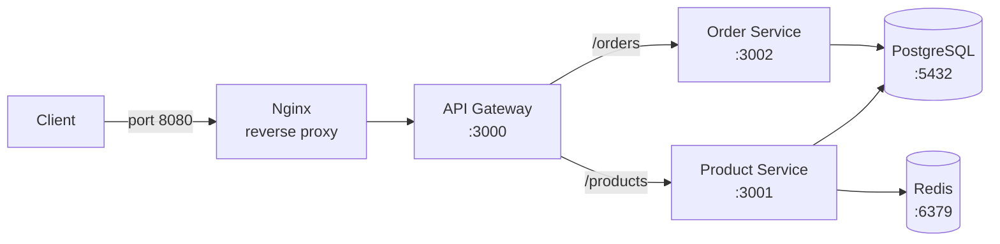

# Microservices E-commerce


A small e-commerce system split into three Node.js services, with PostgreSQL, Redis and Nginx, fully containerised with hardened multi-stage images, orchestrated with Docker Compose, and shipped to Docker Hub by a CI pipeline.

## Architecture

The app has three Node.js services, one database and one cache. Nginx is the single entry point.



| Service | Role | Networks |
|---|---|---|
| nginx | Reverse proxy, rate limiting, the only port exposed to the host | edge |
| gateway | Routes requests to the right service | edge, app |
| product | Manages products, caches the product list in Redis | app, data |
| order | Creates and lists orders, checks products with the product service | app, data |
| postgres | Stores products and orders (named volume) | data |
| redis | Caches product data | data |

**Isolation:** the `app` and `data` networks are internal, so PostgreSQL and Redis cannot be reached from the host, from Nginx, or from the gateway. Each service gets only the access it needs (least privilege).

## Quick start

**Requirements:** Docker 29 or later (tested on 29.4.0) with Docker Compose v2, and Git.

**1. Create your settings file.** Copy the template, then replace the dummy password with a random one:

```bash
cp .env.example .env
sed -i "s/change-me/$(openssl rand -hex 16)/" .env
```

**2a. Development mode** (hot reload and debug ports). Compose merges `docker-compose.override.yml` automatically:

```bash
docker compose up -d --build
docker compose watch
```

Debug ports: gateway `127.0.0.1:9229`, product `9230`, order `9231`.

**2b. Production mode** (pulls released images from Docker Hub, builds nothing):

```bash
docker compose -f docker-compose.prod.yml up -d
```

**3. Try it:**

```bash
curl -X POST localhost:8080/products -H "Content-Type: application/json" -d '{"name":"Keyboard","price":25.50}'
curl localhost:8080/products
curl -X POST localhost:8080/orders -H "Content-Type: application/json" -d '{"product_id":1,"quantity":3}'
curl localhost:8080/orders
```

**4. Stop:** `docker compose down`. Your data stays in the named volumes. Adding `-v` deletes it.

> **Windows (Git Bash) note:** when a Docker command passes a Linux path such as `/etc/...`, prefix it with `MSYS_NO_PATHCONV=1`, or Git Bash rewrites the path.

## Docker design

Each service has one Dockerfile with three named stages, so the same file serves development and production.

| Stage | Purpose | Used by |
|---|---|---|
| `deps` | Installs production packages with `npm ci --omit=dev` | Both stages below |
| `dev` | Runs `node --watch --inspect` for hot reload and debugging | `docker-compose.override.yml` |
| `runtime` | Hardened production image, built by default as the last stage | `docker-compose.yml`, Docker Hub |

**Hardening in the runtime stage:**

- **Pinned base image:** `node:24.21.0-alpine3.24`, so every build uses the same foundation.
- **Non-root user:** runs as `appuser` (UID 1001). Code files are owned by root, so the app can read but not change them.
- **Package managers removed:** npm, npx, yarn and corepack are deleted, reducing what an attacker could use.
- **Only what is needed is copied:** `package.json` and `index.js` by name, plus production `node_modules`. `.dockerignore` keeps `node_modules`, `.env` and other clutter out of the build.
- **Layer caching:** package files are copied and installed before the source code, so a code change does not reinstall packages.
- **Exec-form CMD:** `CMD ["node", "index.js"]` makes Node PID 1, so it receives SIGTERM directly from Docker.
- **Shell-form HEALTHCHECK:** runs through a shell so `$PORT` is replaced with its real value.

**Health checks are readiness checks.** The product service reports healthy only if PostgreSQL and Redis both answer, and the order service only if PostgreSQL answers. The gateway checks only itself. This way Compose never sends traffic to a service that cannot do its job, and one failure does not cascade down the chain.

**Graceful shutdown.** Each service handles SIGTERM: it stops accepting requests, finishes the ones in progress, closes database and Redis connections, then exits. A safety timer forces exit after 8 seconds, before Docker's 10 second limit. In testing, the product service stopped in 0.4 seconds ([evidence](docs/screenshots/10-graceful-shutdown.png)).

**Fail fast.** Each service checks its environment variables at start-up and exits with a clear message if any are missing ([evidence](docs/screenshots/02-product-fail-fast.png)).

## Image size report

Measured on the released `v1.0.1` images. **Compressed** is what is pushed to and pulled from Docker Hub. **Uncompressed** is the unpacked size, summed from `docker history`.

| Image | Compressed | Uncompressed | Added on top of base |
|---|---|---|---|
| `node:24.21.0-alpine3.24` (base) | n/a | 180 MB | n/a |
| `thormie/ecommerce-gateway` | 62.3 MB | 184 MB | 4 MB |
| `thormie/ecommerce-order` | 62.4 MB | 185 MB | 5 MB |
| `thormie/ecommerce-product` | 63.4 MB | 201 MB | 21 MB |

**Against the 150 MB requirement:** all three images are under 150 MB compressed (about 63 MB each), but over 150 MB uncompressed. Both figures are reported here for transparency.

**Why:** the Node.js runtime layer in the official base image is 165 MB on its own, about 90% of every image. The services themselves add only 4 to 21 MB (the product service carries both the PostgreSQL and Redis client libraries).

**Why removing npm did not shrink the image:** image layers are immutable. The `rm -rf` in the runtime stage hides npm in a new layer (65.5 kB), but the 165 MB Node layer underneath still contains it. The removal improves security, not size. See [Known limitations](#known-limitations-and-future-improvements) for how the images could go below 150 MB uncompressed.

**Shared layers on Docker Hub:** the three images share six base layers. Docker Hub stores these once (cross-repository blob mount), so only 2 to 3 small layers per image were uploaded after the first.

Evidence: [image checks](docs/screenshots/03-product-image-checks.png), [all image sizes](docs/screenshots/04-all-image-sizes.png).

## Compose design

Three Compose files, one job each:

| File | Purpose | Command |
|---|---|---|
| `docker-compose.yml` | Base stack, builds the hardened `runtime` images | `docker compose -f docker-compose.yml up -d` |
| `docker-compose.override.yml` | Development mode, merged automatically | `docker compose up -d` |
| `docker-compose.prod.yml` | Production, pulls released images, never builds | `docker compose -f docker-compose.prod.yml up -d` |

**How each Compose requirement is met:**

| Requirement | Implementation | Evidence |
|---|---|---|
| Health check dependencies | `depends_on` with `condition: service_healthy`. Start order: PostgreSQL and Redis, then product, then order, then gateway, then Nginx | [06](docs/screenshots/06-all-services-healthy.png) |
| Named volumes | `postgres-data` and `redis-data`. Data survived removing every container and switching to images pulled from Docker Hub | [15](docs/screenshots/15-prod-pull-and-run.png) |
| Custom networks with isolation | `edge` (Nginx, gateway), `app` (internal), `data` (internal). The gateway cannot resolve PostgreSQL | [09](docs/screenshots/09-isolation.png) |
| Environment variables | All settings come from `.env`, which is git-ignored. `.env.example` documents them. A missing password stops Compose with a clear message (`${POSTGRES_PASSWORD:?...}`) | [05](docs/screenshots/05-env-ignored.png) |
| Resource limits | CPU and memory on every service: Nginx 0.25 CPU / 64 MB, gateway 0.5 / 128 MB, product and order 0.5 / 256 MB, PostgreSQL 1.0 / 512 MB, Redis 0.25 / 128 MB | `docker-compose.yml` |

Redis also runs with `--maxmemory 100mb` and LRU eviction, so it drops old cache entries instead of growing past its container limit. PostgreSQL, Redis and Nginx use exactly pinned versions for reproducible deployments.

## Development mode and hot reload

The override file builds the `dev` stage, opens debug ports on `127.0.0.1` only, and adds a dev-only `debug` network (Docker cannot publish ports from internal networks).

**Why Compose Watch, not a bind mount.** The first version mounted the code folder into the containers. On Windows, the code appeared inside the container but `node --watch` never restarted, because file change signals do not cross from the Windows file system into Linux. This was proven by appending a line to a file: the container could read it, but no restart happened. The fix is **Compose Watch** (`docker compose watch`), which watches files on the host and copies changes into the container, where Linux detects them normally. A change to `package.json` triggers a full rebuild instead.

Evidence: [dev mode running](docs/screenshots/11-dev-mode-running.png), [hot reload](docs/screenshots/12-hot-reload.png), [debug port](docs/screenshots/13-debug-port.png).

## Registry and CI pipeline

**Images:** `thormie/ecommerce-gateway`, `thormie/ecommerce-product` and `thormie/ecommerce-order` on Docker Hub, tagged with semantic versions (`v1.0.0`, `v1.0.1`).

**Pipeline** (`.github/workflows/docker.yml`, GitHub Actions):

- **Push to `main`:** builds all three images in parallel (a matrix), scans each with Trivy, and pushes them tagged with the commit's short ID (`sha-xxxxxxx`).
- **Push a version tag** such as `v1.0.1`: the same, plus the version tag. Only a deliberate Git tag creates a release.
- **Security gate:** if Trivy finds any CRITICAL vulnerability, the job fails and nothing is pushed.
- **Credentials:** the Docker Hub username is a repository variable. The access token is a repository secret, never in the code.

**Release example:** `v1.0.1` removed corepack from the runtime images. It changed the image but not the app's behaviour, so it is a PATCH release. Deploying it meant changing one line in `.env` (`IMAGE_TAG=v1.0.1`).

Evidence: [Docker Hub repositories](docs/screenshots/14-docker-hub-repos.png), [pipeline run](docs/screenshots/20-ci-pipeline-green.png), [v1.0.1 release](docs/screenshots/21-release-v1.0.1.png).

## Security

| Area | What was done |
|---|---|
| Non-root containers | The three app images run as `appuser` (UID 1001). Nginx uses the official unprivileged image. PostgreSQL and Redis start as root and switch to their own users at start-up, as their official images are designed to |
| No secrets in images | Secrets are passed only at runtime through environment variables. `.env` is excluded by `.gitignore` and `.dockerignore`. The CI token is a GitHub secret |
| Health checks | Every service has one. App services use readiness checks, as described above |
| Network exposure | Only Nginx publishes a port. The `app` and `data` networks are internal. Debug ports bind to `127.0.0.1` in dev only |
| Edge protection | Nginx rate limits each client IP (10 requests per second, burst of 20), hides its version (`server_tokens off`) and strips the `X-Powered-By` header |
| Application | SQL uses parameterised queries, preventing SQL injection. Input is validated before use |

**Trivy scan results** (HIGH and CRITICAL only, full reports in [`docs/scans`](docs/scans)):

| Image | HIGH | CRITICAL |
|---|---|---|
| `thormie/ecommerce-gateway:v1.0.1` | 0 | 0 |
| `thormie/ecommerce-product:v1.0.1` | 0 | 0 |
| `thormie/ecommerce-order:v1.0.1` | 0 | 0 |
| `redis:8.10.2-alpine3.23` | 0 | 0 |
| `nginxinc/nginx-unprivileged:1.31.6-alpine3.24` | 0 | 0 |
| `postgres:18.6-alpine3.24` | 21 | 1 |

**All three application images have zero HIGH and zero CRITICAL vulnerabilities.**

**PostgreSQL risk acceptance.** All 22 findings are in `gosu`, a small helper the official image uses once at start-up to switch from root to the `postgres` user. The CRITICAL finding (CVE-2025-68121) is in the Go language's TLS code that gosu was built with. gosu makes no network connections, so the flawed code is not reachable, and PostgreSQL sits on an internal network. The fix requires the image maintainers to rebuild gosu with a newer Go version. The image will be updated when that release is available.

Evidence: [Trivy summary](docs/screenshots/16-trivy-summary.png).

## Test evidence

| # | Test | Result |
|---|---|---|
| [01](docs/screenshots/01-project-structure.png) | Project structure | Folders per service, docs, Nginx |
| [02](docs/screenshots/02-product-fail-fast.png) | Missing configuration | Service exits with a clear message |
| [03](docs/screenshots/03-product-image-checks.png) | Image checks | Runs as UID 1001, npm removed |
| [04](docs/screenshots/04-all-image-sizes.png) | Image sizes | About 63 MB compressed each |
| [05](docs/screenshots/05-env-ignored.png) | Secrets | `.env` not tracked by Git |
| [06](docs/screenshots/06-all-services-healthy.png) | Start-up | All services healthy, in dependency order |
| [07](docs/screenshots/07-products-and-cache.png) | Products and cache | First read from database, second from cache |
| [08](docs/screenshots/08-orders.png) | Service communication | Order total calculated, unknown product rejected |
| [09](docs/screenshots/09-isolation.png) | Network isolation | Gateway cannot resolve PostgreSQL |
| [10](docs/screenshots/10-graceful-shutdown.png) | Graceful shutdown | SIGTERM handled, stopped in 0.4 seconds |
| [11](docs/screenshots/11-dev-mode-running.png) | Dev mode | Services run `node --watch` |
| [12](docs/screenshots/12-hot-reload.png) | Hot reload | Code change restarts the app without a rebuild |
| [13](docs/screenshots/13-debug-port.png) | Debug port | Node debugger answers on port 9230 |
| [14](docs/screenshots/14-docker-hub-repos.png) | Registry | Three public repositories on Docker Hub |
| [15](docs/screenshots/15-prod-pull-and-run.png) | Production deploy | Images pulled from Docker Hub, data persisted |
| [16](docs/screenshots/16-trivy-summary.png) | Vulnerability scan | Zero findings in application images |
| [18](docs/screenshots/18-nginx-single-entry.png) | Single entry point | Only Nginx exposes a port, no version shown |
| [19](docs/screenshots/19-rate-limit.png) | Rate limiting | 30 accepted, 30 rejected with 429 |
| [20](docs/screenshots/20-ci-pipeline-green.png) | CI pipeline | All three jobs built, scanned and pushed |
| [21](docs/screenshots/21-release-v1.0.1.png) | Release | `v1.0.1` published by a Git tag |

**Note on the rate limit test:** a first test from Git Bash let all 40 requests through, because starting each `curl` on Windows was too slow to create a real flood. Firing 60 requests at once from inside the Nginx container proved the limit, and Nginx's own log confirmed 30 replies with status 429.

## Known limitations and future improvements

- **Image size.** The images are over 150 MB uncompressed because of the 165 MB Node.js layer. Building the runtime stage on plain `alpine:3.24` and copying in only the `node` binary is estimated to bring them to about 130 MB.
- **Shared database server.** Each service owns its own table, but both share one PostgreSQL server. The textbook pattern is a separate database per service.
- **PostgreSQL image findings.** Awaiting an upstream rebuild of `gosu`, as described under Security.
- **No automated tests in CI.** The pipeline builds and scans but does not run application tests. Adding them would stop a broken build from being released.
- **Action pinning.** Workflow actions are pinned by version (for example `@v4`). Pinning to exact commit IDs would guard against a version label being moved.
- **Nginx address caching.** Nginx looks up the gateway's address once at start-up. If the gateway container is recreated on its own, Nginx needs a restart. Using Docker's DNS resolver with a variable in `proxy_pass` would remove this.
- **Duplicated Compose settings.** `docker-compose.prod.yml` repeats most of `docker-compose.yml`, so a change must be made in both.
- **Secrets on a server.** Production still reads the password from a `.env` file. A secrets manager or Docker secrets would be safer for a real deployment.
