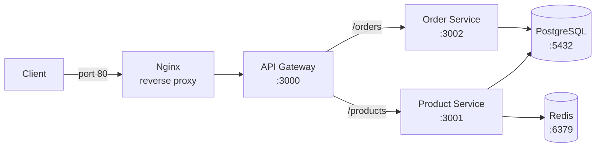

# Microservices E-commerce

## Architecture

The app is a small e-commerce system with three Node.js services, one database and one cache. Nginx is the single entry point.

| Service | Role | Networks |
|---|---|---|
| nginx | Reverse proxy, rate limiting, only port exposed to the host | edge |
| gateway | Routes requests to the right service | edge, app |
| product | Manages products, caches the product list in Redis | app, data |
| order | Creates and lists orders | app, data |
| postgres | Stores products and orders (named volume) | data |
| redis | Caches product data | data |

**Isolation:** the `data` network is internal, so PostgreSQL and Redis cannot be reached from the host, from Nginx, or from the gateway. Each service gets only the access it needs (least privilege).
